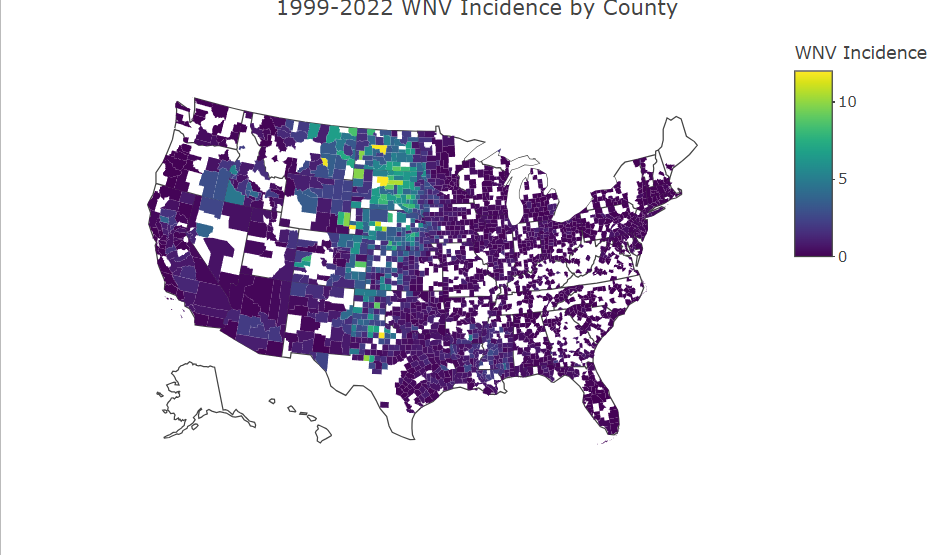
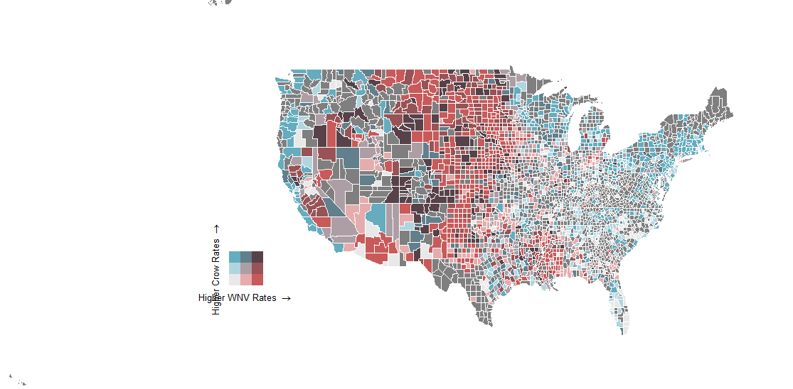
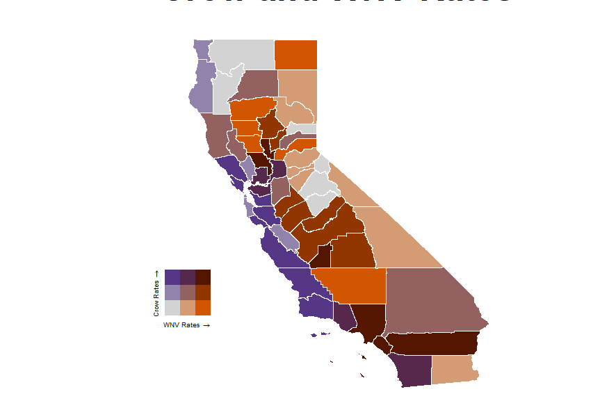
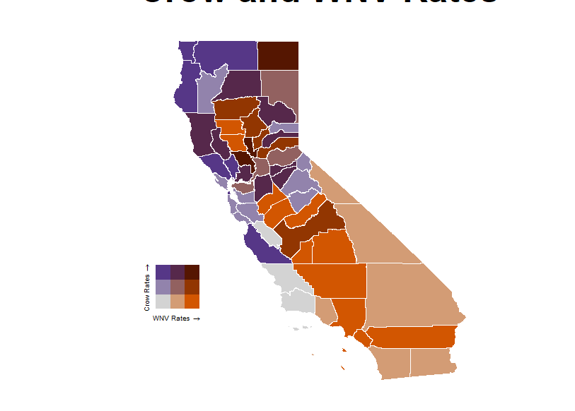

# 🐦 Crow Populations & West Nile Virus Analysis

## 📌 Overview
This project investigates whether **American Crow populations** correlate with **West Nile Virus (WNV) incidence** in the United States, with a focus on California.  
The analysis combines **Cornell Lab EBIRD citizen science data** (millions of bird observations) with **CDC West Nile Virus data** (1999–2022), cleaned and merged at the county level.  

**Key Finding:** In California, there is **no significant correlation** between crow populations and WNV incidence, despite assumptions in ecological literature.  

---

## 🌍 Data Sources
- **EBIRD** – Bird population datasets (Cornell Lab of Ornithology)  
- **CDC** – West Nile Virus incidence data  

⚠️ *Note:* Raw datasets are **not included** in this repository because:  
- They are proprietary (Cornell Lab provided data specifically for this project).  
- The raw dataset was ~**4GB** and reduced to ~**500KB** after cleaning, which exceeds GitHub’s storage limits.  

---

## 🛠️ Tools & Libraries
- **R (tidyverse, maps, biscale, cowplot, sf)** – Cleaning, merging, statistical analysis, visualization  
- **Python & Excel** – Supplemental preprocessing  
- **Plotly** – Interactive choropleths  
- **ggplot2 + biscale** – Publication-ready bivariate maps  

Main tasks:  
- Data cleaning (removing non-numeric observation counts, converting EBIRD “X” to 0, handling 4GB raw input).  
- Aggregation of bird counts by county using **FIPS codes**.  
- Merging EBIRD bird counts with CDC WNV incidence.  
- Creating single-variable and bivariate choropleth maps.  

---

## 📊 Visual Results

### WNV Incidence Rates in the United States  

### Crow Populations vs. WNV – United States  

### California Focus: Crow Populations vs. WNV  

### California Focus: Robin Populations vs. WNV  

---

## 📑 Workflow Summary
1. **Data Cleaning**  
   - Removed unused EBIRD columns (~40+ dropped).  
   - Converted non-numeric values (“X”) into numeric observation counts.  
   - Aggregated total crow observations by county.  

2. **Merging with CDC Data**  
   - Normalized **county FIPS codes** for consistent merging.  
   - Combined EBIRD crow totals with CDC WNV incidence.  
   - Computed per-capita crow sighting rates relative to human population.  

3. **Visualization**  
   - **Plotly** choropleths for interactive exploration.  
   - **ggplot2 + biscale** for bivariate maps showing correlation (or lack thereof).  
   - Side-by-side maps for U.S. and California case studies.  

---

## 📑 Findings
- **No correlation** between American Crow populations and WNV incidence in California.  
- Alternative bird species (e.g., robins) may be better predictors.  
- Ecological risk mapping should consider **multi-species and environmental factors**, not just crow populations.  

---

